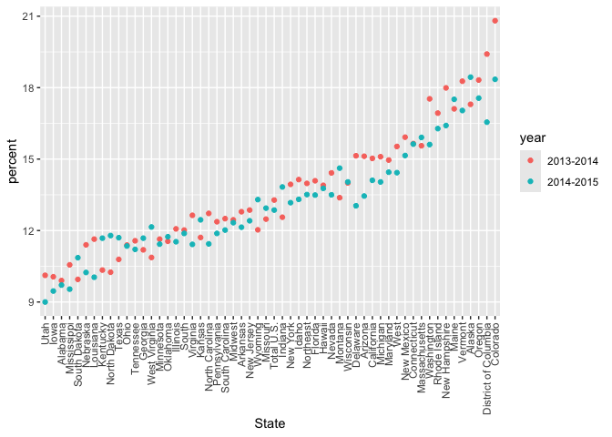

string and factors
================

``` r
library(tidyverse)
```

    ## ── Attaching core tidyverse packages ──────────────────────── tidyverse 2.0.0 ──
    ## ✔ dplyr     1.1.4     ✔ readr     2.1.5
    ## ✔ forcats   1.0.0     ✔ stringr   1.5.1
    ## ✔ ggplot2   3.5.1     ✔ tibble    3.2.1
    ## ✔ lubridate 1.9.3     ✔ tidyr     1.3.1
    ## ✔ purrr     1.0.2     
    ## ── Conflicts ────────────────────────────────────────── tidyverse_conflicts() ──
    ## ✖ dplyr::filter() masks stats::filter()
    ## ✖ dplyr::lag()    masks stats::lag()
    ## ℹ Use the conflicted package (<http://conflicted.r-lib.org/>) to force all conflicts to become errors

``` r
library(rvest)
```

    ## 
    ## Attaching package: 'rvest'
    ## 
    ## The following object is masked from 'package:readr':
    ## 
    ##     guess_encoding

``` r
library(p8105.datasets)
```

## do strings

``` r
string_vec = c("my","name","is","SQ")

str_detect(string_vec,"a")
```

    ## [1] FALSE  TRUE FALSE FALSE

``` r
str_replace(string_vec,"SQ", "sq")
```

    ## [1] "my"   "name" "is"   "sq"

``` r
string_vec = c(
  "i think we all rule for participating",
  "i think i have been caught",
  "i think this will be quite fun actually",
  "it will be fun, i think"
  )

str_detect(string_vec, "^i think")
```

    ## [1]  TRUE  TRUE  TRUE FALSE

``` r
str_detect(string_vec, "i think")
```

    ## [1] TRUE TRUE TRUE TRUE

``` r
string_vec = c(
  "Time for a Pumpkin Spice Latte!",
  "went to the #pumpkinpatch last weekend",
  "Pumpkin Pie is obviously the best pie",
  "SMASHING PUMPKINS -- LIVE IN CONCERT!!"
  )

str_detect(string_vec,"[Pp]umpkin")
```

    ## [1]  TRUE  TRUE  TRUE FALSE

``` r
str_detect(string_vec,"pumpkin")
```

    ## [1] FALSE  TRUE FALSE FALSE

``` r
str_detect(string_vec,"Pumpkin")
```

    ## [1]  TRUE FALSE  TRUE FALSE

``` r
string_vec = c(
  '7th inning stretch',
  '1st half soon to begin. Texas won the toss.',
  'she is 5 feet 4 inches tall',
  '3AM - cant sleep :('
  )

str_detect(string_vec, "^[0-9][a-zA-Z]")
```

    ## [1]  TRUE  TRUE FALSE  TRUE

``` r
str_detect(string_vec, "[0-9][a-z]")
```

    ## [1]  TRUE  TRUE FALSE FALSE

``` r
string_vec = c(
  'Its 7:11 in the evening',
  'want to go to 7-11?',
  'my flight is AA711',
  'NetBios: scanning ip 203.167.114.66'
  )

str_detect(string_vec, "7.11") # . matches everything
```

    ## [1]  TRUE  TRUE FALSE  TRUE

``` r
string_vec = c(
  'The CI is [2, 5]',
  ':-]',
  ':-[',
  'I found the answer on pages [6-7]'
  )

str_detect(string_vec, "\\[") # "\\" Some characters are “special”. These include [ and ], ( and ), and .. If you want to search for these, you have to indicate they’re special using \. Unfortunately, \ is also special, so things get weird.
```

    ## [1]  TRUE FALSE  TRUE  TRUE

``` r
sex_vec=factor(c("male","male","female","female"))
as.numeric(sex_vec)
```

    ## [1] 2 2 1 1

``` r
sex_vec = fct_relevel(sex_vec, "male")
as.numeric(sex_vec)
```

    ## [1] 1 1 2 2

## revisit lots of examples

``` r
url = "http://samhda.s3-us-gov-west-1.amazonaws.com/s3fs-public/field-uploads/2k15StateFiles/NSDUHsaeShortTermCHG2015.htm"
drug_use_html = read_html(url)

drug_use_html
```

    ## {html_document}
    ## <html lang="en">
    ## [1] <head>\n<link rel="P3Pv1" href="http://www.samhsa.gov/w3c/p3p.xml">\n<tit ...
    ## [2] <body>\r\n\r\n<noscript>\r\n<p>Your browser's Javascript is off. Hyperlin ...

``` r
major_use_df = 
  drug_use_html |>
  html_table() |>
  first() |>
  slice(-1)|>
  select(-contains("P Value"))|>
  pivot_longer(
    cols= -State,
    names_to = "age_year",
    values_to = "percent"
  )|>
  separate(age_year, into = c("age", "year"), sep = "\\(")|>
  mutate(
    year = str_replace(year, "\\)", ""),
    percent = str_remove(percent,"[a-c]$"),
    percent = as.numeric(percent)
  )
```

``` r
major_use_df|>
  filter(
    age == "12-17"
    )|>
  mutate(
    State = fct_reorder(State,percent)
  ) |>
  ggplot(aes(x=State, y = percent, color = year))+
  geom_point() +
  theme(axis.text.x = element_text(angle = 90, vjust = 0.5,hjust = 1))
```

<!-- -->
